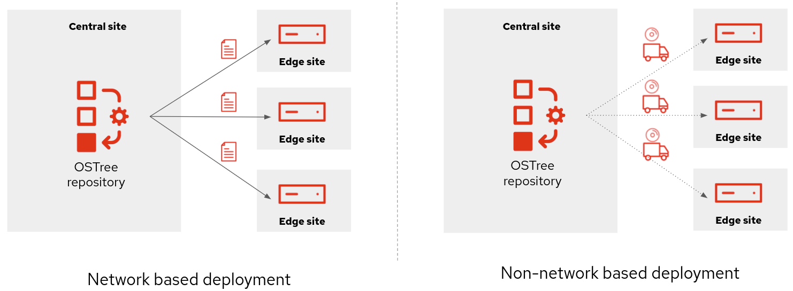
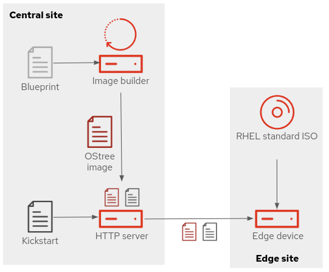
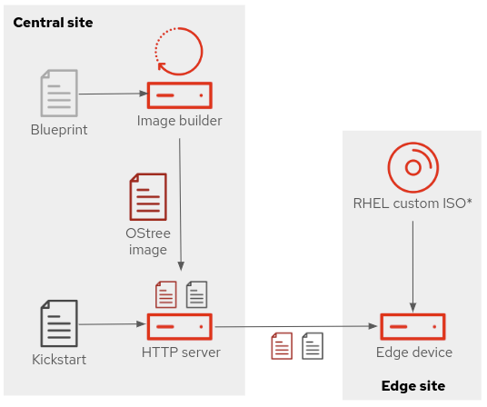
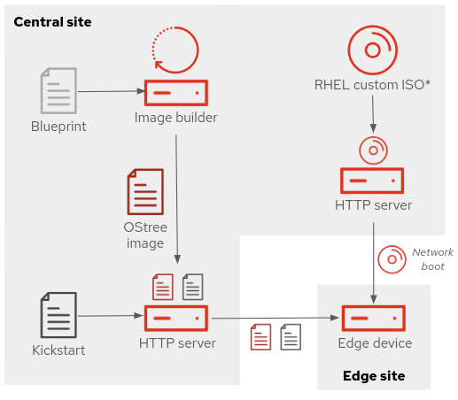
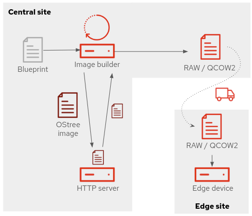

# Description


These scripts help to quickly create and publish RHEL for Edge images. You should execute them in a RHEL 8 or RHEL 9 server (which will become the image-builder and repo server for RHEL for Edge images).

> NOTE: Remember that if you want to install RHEL for Edge on ARM systems, the image will need to be created in an image-builder RHEL deployed also in an ARM server. 

# Usage

If you already have your RHEL system installed and subscribed, you just need to:

0) Run the `0-pre-requisites-osbuild.sh` script to deploy image-builder

1) Create your RHEL for edge image based on a blueprint with `1-create-image.sh`. You can find a blueprint example in `blueprint.toml.example`

2) Publish the image with `2-publish-image.sh` 

3) (optional) Create an ISO or RAW image for offline deployments with `3-create-offline-deployment.sh`


> NOTE: You can get help and examples by typing  `<script> --help`


# RHEL for Edge deployment types

There are two main groups of RHEL for Edge deployment types:

* Deploying by accessing to the base OSTree repository using the network (network based deployment)

* Creating an ISO/image with the OSTree repository embed to deploy without the need of accessing to the repository using the network (non-network based deployment)


<p align="center">  </p>
<p align="center"> Network VS Non-network based deployments  <br></br> </p>

In these scripts we find several options per type:

1) Network based deployment
    * Online repo using standard RHEL ISO 
    * Online repo using custom RHEL ISO
    * UEFI HTTP Boot using the custom RHEL ISO

2) Non-network based deployment
    * Offline unattended ISO 
    * Offline attended ISO
    * RAW/QCOW2 image

Let's review each of them in the following section.

## Network based deployment

There are three options while deploying RHEL for Edge following the network based approach:

### Option 1) Online repo using standard RHEL ISO 
<p align="center">  </p>
<p align="center"> Network based deployement with standard RHEL ISO  <br></br>  </p>

With this option you will run a container with nginx serving the OSTree depository along with a kickstart.ks file. The edge node will be deployed with the standard RHEL ISO but using the kickstart published in the server by configuring manually a kernel argument before proceding with the install.

If you want to use this approach you need to:

1) Create the RHEL for Edge image with `1-create-image.sh` script and copy the image ID.
```
./1-create-image.sh -b <blueprint-filename>
``` 

2) Publish the image with this command (here using IP and port defaults):

```
./2-publish-image.sh -i <image-id>
``` 

3) In order to deploy the image you just need to use the default RHEL boot ISO on the edge server/VM and introduce (pressing `TAB` during the GRUB menu) the required kernel arg (`inst.ks`) pointing to the kickstart file published in the server, something like this: 

```
<other kernel args> inst.ks=http://192.168.122.129:8080/kickstart.ks
```


### Option 2) Online repo using custom RHEL ISO
<p align="center">  </p>
<p align="center"> Network based deployement with customized (kickstart) RHEL ISO <br></br> </p>

This is similar to the previous option but instead of interupting the default RHEL installation to include the `inst.ks` kernel argument manually, you create a custom ISO based on the default boot ISO.

> NOTE: The script will use the kickstart.ks file from the HTTP server, but you could also embed the actual kickstart file in the ISO (although introducing modifications to the kickstart will be more tedious)


If you want to use this approach you need to:

1) Create the RHEL for Edge image with `1-create-image.sh` script and copy the image ID.
```
./1-create-image.sh -b <blueprint-filename>
``` 

2) Publish the image with this command (here using IP and port defaults) and pointing to the previously downloaded default RHEL boot ISO:

```
./2-publish-image.sh -i <image-id> -e <RHEL-default-ISO>
```

3) Start the edge server/VM from the custom ISO that you will find in the `images` directory (with a filename similar to `<image-id>-custom-kernelarg.iso`)


### Option 3) UEFI HTTP Boot using the custom RHEL ISO
<p align="center">  </p>
<p align="center"> Network based deployement with custom (kickstart) RHEL ISO using network boot  <br></br> </p>

In this deployment type the script will get the contents from the OSTree repo published in the NGINX and create an additional HTTP server where this ISO image will be published to be used as UEFI HTTP boot source. It could be done with traditional PXE Boot but since UEFI HTTP boot supports IPv6 and seems to be the future I included this option.


> NOTE: In the official DOCS you will find they they use the "offline fully automated ISO" (description in the non-network based deployment) instead of the custom iso of previous step, but when using network boot I find that it makes more sense to have the OSTree remote repo pointing to a network server instead of to the local resource that you will get with the simplified ISO, which simplifies OSTree image updates.


If you want to use this approach you need to:

1) Create the RHEL for Edge image with `1-create-image.sh` script and copy the image ID.
```
./1-create-image.sh -b <blueprint-filename>
``` 

2) Publish the image with this command (here using IP and port defaults) and pointing to the previously downloaded default RHEL boot ISO:

```
./2-publish-image.sh -i <image-id> -e <RHEL-default-ISO> -x <UEFI-HTTP-boot-server-port>
```

3) Deploy the edge server by starting using UEFI boot and the NIC as the device for the first boot. You will find that the boot will attempt to use PXE boot before UEFI HTTP boot...so you will need to wait a bit until the install begins

> NOTE: Your Edge server must have at least 2GB of RAM in order to download the ISO to memory during the installation process


> NOTE: In order to use UEFI HTTP boot you will need to include the UEFI HTTP boot server as a DHCP option.
>
> If you are using libvirt and VMs this is an example of the network setup:
```
 <network xmlns:dnsmasq="http://libvirt.org/schemas/network/dnsmasq/1.0">
   <name>default</name>
   <uuid>3328ebe7-2202-4e3b-9ca3-9ddf357db576</uuid>
   <forward mode="nat">
     <nat>
       <port start="1024" end="65535"/>
     </nat>
   </forward>
   <bridge name="virbr0" stp="on" delay="0"/>
   <mac address="52:54:00:16:0e:63"/>
   <ip address="192.168.122.1" netmask="255.255.255.0">
     <tftp root="/var/lib/tftpboot"/>
     <dhcp>
       <range start="192.168.122.2" end="192.168.122.254"/>
       <bootp file="pxelinux.0"/>
     </dhcp>
   </ip>
   <dnsmasq:options>
     <dnsmasq:option value="dhcp-vendorclass=set:efi-http,HTTPClient:Arch:00016"/>
     <dnsmasq:option value="dhcp-option-force=tag:efi-http,60,HTTPClient"/>
     <dnsmasq:option value="dhcp-boot=tag:efi-http,&quot;http://192.168.122.128:8081/EFI/BOOT/BOOTX64.EFI&quot;"/>
   </dnsmasq:options>
 </network>
```
>
> For DHCP servers like dhcpd, something like this:
```
   class "pxeclients" {
      match if substring (option vendor-class-identifier, 0, 9) = "PXEClient";
      next-server 192.168.111.1;
      filename "/bootx64.efi";
    }
    class "httpclients" {
      match if substring (option vendor-class-identifier, 0, 10) = "HTTPClient";
      option vendor-class-identifier "HTTPClient";
      filename "http://192.168.122.128:8081/EFI/BOOT/BOOTX64.EFI";
    }
```


## Non-network based deployment

For deploying RHEL for Edge in isolated environments where you cannot reach the OSTree repo server, you also have multiple options. In these scrips you have three:

### Option 1) Offline unattended deployment ISO
<p align="center">  </p>
<p align="center"> Non-network based unattended deployement with custom (OSTree repo) RHEL ISO <br></br>  </p>

With this option you create an ISO that installs the OSTree repo in unattended installation.


If you want to use this approach you need to:

1) Create the RHEL for Edge image with `1-create-image.sh` script and copy the image ID.
```
./1-create-image.sh -b <blueprint-filename>
``` 

2) Publish the image with this command:

```
./2-publish-image.sh -i <image-id> 
```

3) Create the automated ISO using the OSTree repository published in the previous step (in this case using the default IP and port):

```
 ./3-create-offline-deployment.sh
```

4) Install the Edge server by booting from the created ISO that you will find in `images` directory (the file name will be something like `<image-id>-simplified-installer.iso`) 

> NOTE: Install using this ISO with UEFI boot loader otherwise you will get `error code 0009`

> NOTE: If you are deploying on VMs be sure that the disk is using SATA drivers instead of VirtIO, in order to get a fully unattendant installation


### Option 2) Offline attended deployment ISO
<p align="center">  </p>
<p align="center"> Non-network based attended deployement with custom (OSTree repo) RHEL ISO  <br></br>  </p>

This option is similar to the previous one, but instead of a fully automated install, you will get the Anaconda installer screen where you can for example select the drive where to install the system and configure the network.


If you want to use this approach you need to:

1) Create the RHEL for Edge image with `1-create-image.sh` script and copy the image ID.
```
./1-create-image.sh -b <blueprint-filename>
``` 

2) Publish the image with this command:

```
./2-publish-image.sh -i <image-id> 
```

3) Create the semi-automated ISO using the OSTree repository published in the previous step (in this case using the default IP and port):

```
 ./3-create-offline-deployment.sh -a
```

4) Install the Edge server by booting from the created ISO that you will find in `images` directory (the file name will be something like `<image-id>-installer.iso`). You will need to complete all the information (mainly root disk and network info) once Anaconda screen is presented in order to proceed with the install


> NOTE: Install using this ISO with UEFI boot loader otherwise you will get `error code 0009`


### Option 3) RAW/QCOW2 unattended image
<p align="center">  </p>
<p align="center"> Non-network based deployement with RAW/QCOW2 image <br></br>  </p>

With this option you will create a RAW and a QCOW2 image file instead of an ISO. 


If you want to use this approach you need to:

1) Create the RHEL for Edge image with `1-create-image.sh` script and copy the image ID.
```
./1-create-image.sh -b <blueprint-filename>
``` 

2) Publish the image with this command:

```
./2-publish-image.sh -i <image-id> 
```

3) Create the RAW and QCOW2 files using the OSTree repository published in the previous step (in this case using the default IP and port):

```
 ./3-create-offline-deployment.sh -r
```

4) You can use the files (`<image-id>-image.raw` and `<image-id>-image.qcow2` in `images` directory) to directly `dd` to a hard drive or to create a VM using it as main disk.


# RHEL for Edge image update

The `1-create-image.sh` can create a new version of an OSTree repository to update running systems.


## Creating an update

You just need to follow two steps:

1) Make changes or create a new blueprint file and then use the `-u` argument to create an update to the last image commit (remember to copy the image ID):

```
./1-create-image.sh -b <updated-blueprint> -u
```

2) Publish the updated OSTree repo

```
./2-publish-image.sh -i <image-id>
```

## Updating a system

Updating a system that is using an "online" OSTree repository is different that one that only points to the system-local repository.


### Updating a system using a network repository

This method is valid for the "Network based deployments" explained in the previous section. You can check how those systems have a remote OSTree repository configured:

```
# cat /etc/ostree/remotes.d/edge.conf 

[remote "edge"]
url=http://192.168.122.128:8080/repo/
gpg-verify=false
```

Or you can use this command:

```
ostree remote list
```

You can check that there is a new update for the image with `rpm-ostree update --check` or `rpm-ostree update --preview` and apply the update with the following command as a privileged user on the edge system:

```
# rpm-ostree update -r
```

> NOTE: The `-r` makes the system reboot after downloading the update (not the default), since the new image is only used after the next reboot


### Updating a system using a local repository

In the "Non-network based deployments" you won't find any "OSTree" remote, so you will be using the system-local repository that was deployed using either the ISO or the RAW/QCOW2 image.

If you want to update these systems, you will need to either create a new build on the system or by using a new build comming from an external resource such as an USB or SD card.


The steps to complete an offline upload are:

1) Copy the commit file from the image-builder which contains the new build with the OSTree update (it should be in the images directory with a name similar to `<image-id>-commit.tar`) to edge system (with an USB, SD card, DVD, ...)


2) Untar the `<image-id>-commit.tar` into a local directory on the edge server

```
# mkdir new-build
# tar xvf <image-id>-commit.tar -C new-build/
```

3) Pull from the local repository

```
# ostree pull-local new-build/repo
```

> NOTE: You need to reference to the `repo` directory that you will find in the directory where you untar the TAR file


4) Update using rpm-ostree update as we shown in the previous section

```
# rpm-ostree update -r
```

> NOTE: It's a good practice to take a look to the changes before with this command

```
# rpm-ostree update --preview

AvailableUpdate:
        Version: 8.5 (2022-04-18T17:26:14Z)
         Commit: 045c135c710585ab095a5bf2fd4d4c3553d3bccd6d759805eb24829519228a07
        Removed: zsh-5.5.1-6.el8_1.2.x86_64
```


# Demos

Here you can find some demos using RHEL for Edge.

## Microshift

If you want to include [Microshift](https://github.com/redhat-et/microshift) in the deployment you will need to add some additional repositories in the image-builder, so I created the script `add-microshift-repos.sh` under `demos/microshift` directory that you will need to execute right **before** creating the image with script `1-create-image.sh`.

> NOTE: As result of runnning this script you will include files under `/etc/osbuild-composer/repositories/` which it's a good idea to remove right after you created the microshift image in order to not impacting other image builds. 


If you want to take a look at a blueprint example including the microshift packages you can also find it in `blueprint-microshift.toml.example`


## Serverless service with podman image auto-update

This demo.based on a [Red Hat Summit 2021 demo](https://github.com/RedHatGov/RFESummit2021), shows how you can create a Serverless service using  [Podman](https://podman.io/) automating the installation using the `kickstart.ks` file. You will be also able to play with the [Podman auto-update feature](https://docs.podman.io/en/latest/markdown/podman-auto-update.1.html).

### Preparing the demo

The steps to run this demo are:

1) Create the container image for the Serverless service

If you want to create an image with a simple HTTP server (you could potentially use another image that you already have) you can use the `Dockerfile` in the `service` directory to create a new image and then push that image to a registry:

```
cd demos/serverless-autoupdate
cd service
buildah build .
podman tag <image id> <registry/user/image:tag>
podman push <registry/user/image:tag>
cd ..
```

> NOTE: Use the image id that buildah build will output to add a tag to it (ie. in my case `podman tag d5a11c5eb67 quay.io/luisarizmendi/simple-http:prod`)


2) Prepare the kickstart.ks for the automated configuration using `kickstart-serverless.toml.example` as reference

You will need to point to the right repository IP in the kickstart and also to the service image (on the registry) that you will use, so make a copy of the kickstart example file (ie, `cp kickstart-serverless.ks.example ../../kickstart.ks`) and change the required values.

You should look for the string `192.168.122.157:8080` (1 occurrence) and substitute it by your repo server and `quay.io/luisarizmendi/simple-http:prod` (2 occurrences) by the URL that points to your image in the registry. 


3) Prepare the blueprint using the `blueprint-serverless.toml.example` as reference

Make a copy of the blueprint example file (ie, `cp blueprint-serverless.toml.example ../../blueprint.toml`) and include the SSH key and the password hash.


4) Run any of the [Network based deployment methods](https://github.com/luisarizmendi/rhel-edge-quickstart#network-based-deployment) to create the Rhel for Edge repository (you don't have a kickstart file when using the off-line approaches)


### Running the demo

Once the edge device is deployed, you can check your **Serverless** service by doing this:

1) Look for the edge device IP address and ssh to it (using the `admin` user if you used the blueprint example)

2) Check that the container image has been auto-pulled for the `core` user (it could take some time depending on your connection): `sudo runuser -l core -c "podman image list"`

```
[admin@edge-node ~]$ sudo runuser -l core -c "podman image list"

[sudo] password for admin: 

REPOSITORY                         TAG         IMAGE ID      CREATED      SIZE
quay.io/luisarizmendi/simple-http  prod      d5a11c5eb672  3 hours ago  435 MB

```

3) Continuously check that the containers running on the system (at this point you should find an empty list): `sudo runuser -l core -c "watch podman ps"`

4) Access the service published on port 8080 on the edge device (`http://<edge-device-ip>:8080`)

At this point you will see how a new container will start as soon as the request is made (Serverless)


If you want to check the podman **image auto-update** feature you can:

1) Access the service published on port 8080 on the edge device (`http://<edge-device-ip>:8080`) and check the message

2) Change the message in the `index.html` file, create a new container image and push it to the registry using the same tag that you used

```
cd demos/serverless-autoupdate
cd service
echo "NEW MESSAGE IN v2" > index.html
buildah build .
podman tag <image id> <registry/user/image:tag>
podman push <registry/user/image:tag>
cd ..
```

3) Wait some seconds and try to access again the service on the edge device (the new message should appear)