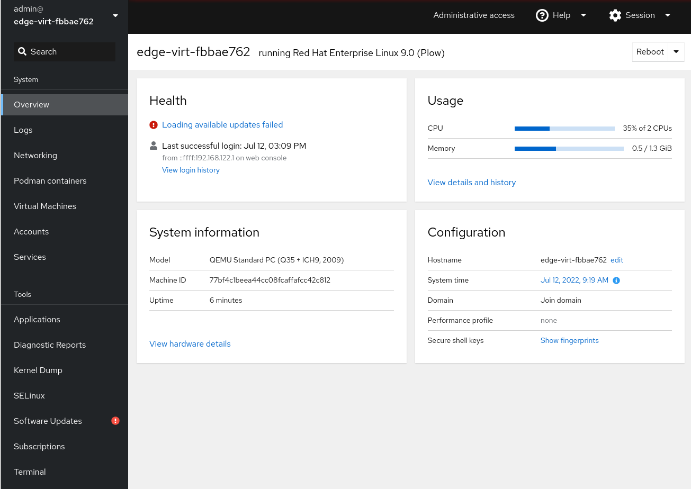
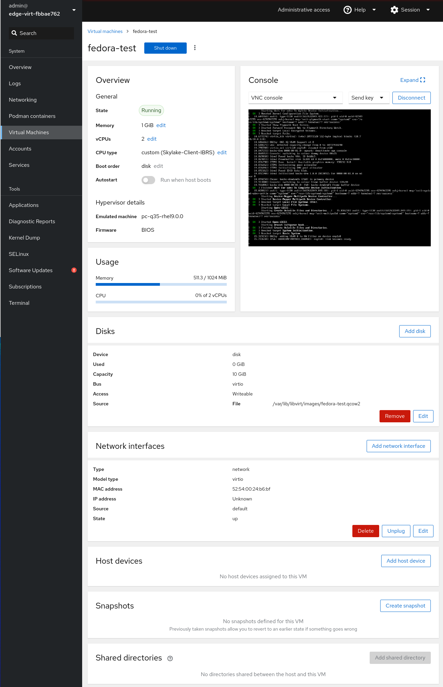
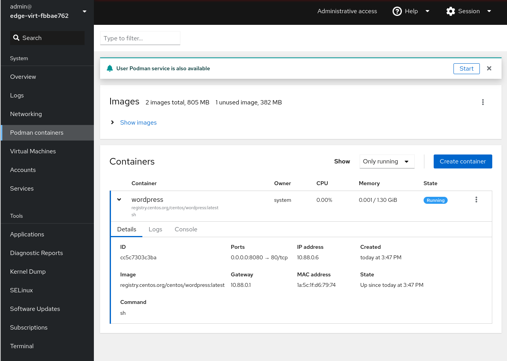
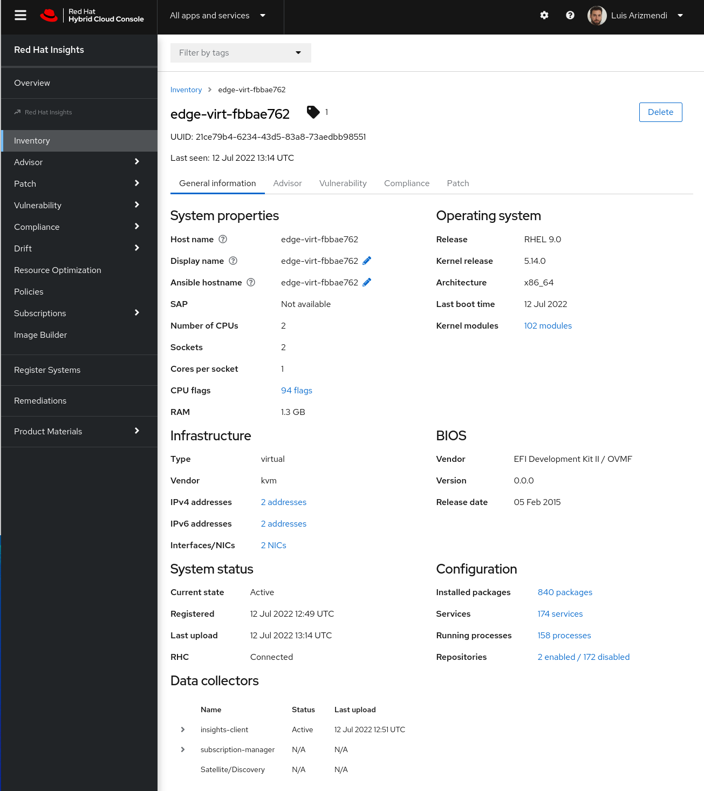
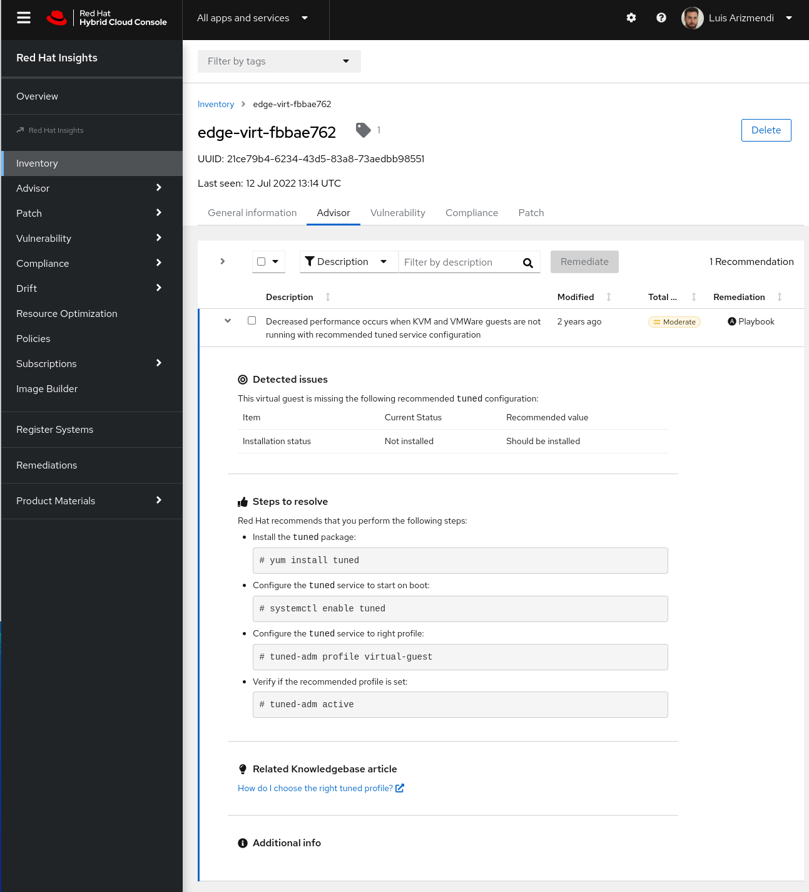
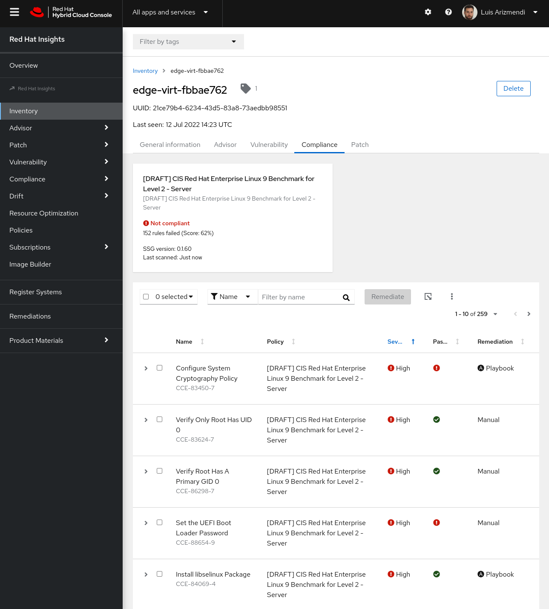
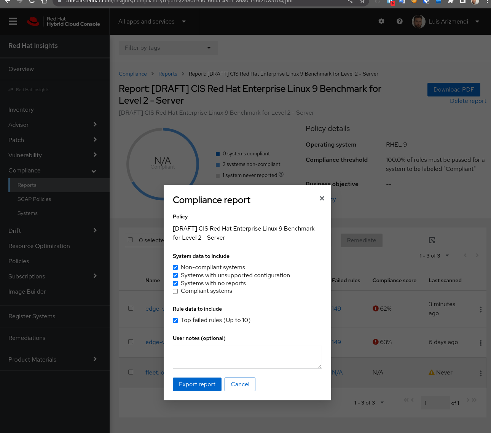
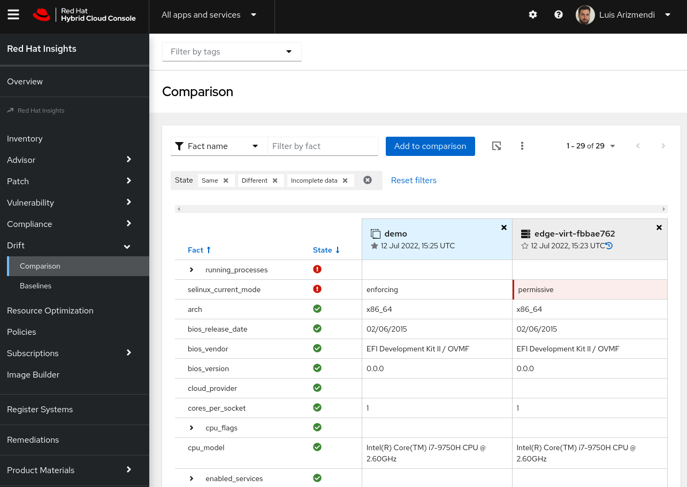

# Cockpit and Insights using FDO demo

This demo shows the deployment of a RHEL for Edge system registered in Red Hat Console using [FIDO Device Onboard](https://fidoalliance.org/intro-to-fido-device-onboard/), so you won't need to include any sensitive information (such as Red Hat console credentials) into the ISO image that you will need to deliver to deploy the system, and with the local Cockpit GUI tool installed.

> NOTE: Tested with RHEL 9.0

If you are interested on running the steps of this demo manually, you can [follow this guide](https://luisarizmendi.github.io/tutorial-secure-onboarding/fdo-tutorial/index.html).

## Preparing the demo

The steps to prepare this demo are:

1) 2) Prepare the blueprint using the `blueprint-insights.toml.example` as reference including the ssh key and user information.

Make a copy of the blueprint example file (ie, `cp blueprint-insights.toml.example ../../blueprint-insights.toml`) and include the SSH key and the password hash.


3) In the FDO `serviceinfo_api_server.yml.example` file. include
* Your public SSH key
* The right disk drive (`disk_label` parameter) 
* Your Red Hat console credentials. You will need to include the[activation key and the organization ID](https://access.redhat.com/articles/3047431) in the `<MY ORGID>` and `<MY ACTIVATIONKEY>` placeholders.

> NOTE: There are other parameters such as `service_info_auth_token` and `admin_auth_token` that will be filled in by the `prepare-fdo-server.sh` during next step.

> NOTE: The file `serviceinfo_api_server.yml.example` has configured the usage of a TPM device to encrypt the disk, so be sure that you device or VM has a TPM or remove that section from the file.

4) Run the `prepare-fdo-server.sh` script to prepare the required files on the fdo server, which completes the information contained by `serviceinfo_api_server.yml.example` and make it affective in the FDO service running on the server. 


5) Back to the root folder (`cd ../../`) and use the blueprint-insights.toml with any of the [Non-Network based deployment methods](https://github.com/luisarizmendi/rhel-edge-quickstart#non-network-based-deployment) including the FDO serve (`-f`) during the last step.

Example using default values and vda as disk where to install the OS:

```
./1-create-image.sh -b blueprint-insights.toml

./2-publish-image.sh -i 5676ff58-a6c7-4c49-a402-b70467602224

./3-create-offline-deployment.sh -f -d vda
```

> NOTE: Remember to use UEFI boot loader in your system


## Running the demo

The demo will focus first on managing and get some information directly from the device (using a GUI) and then move to [Red Hat console](https://console.redhat.com) and show some of its features. 

> NOTE: After the deployment it could take some time until the fdo-client runs and configures everything. You can double check if that happened taking a look at the Journal (`journalctl | grep "Performing TO2 protocol"`) or forcing it with `systemctl restart fdo-client-linuxapp.service`.


### Cockpit

Once the edge device is deployed, you can find the IP of the device in the console screen (if any) since you will see a message like this one:

`Web console: https://localhost:9090/ or https://<device ip>:9090/ `

1) Cockpit GUI

The blueprint used to deploy the device includes `Cockpit` GUI to manage directly the node, so try to log into it in `https://<device ip>:9090/` using the user and password configured in the blueprint. You should see something like this:

> NOTE: Probably you won't be using root user, so in order to get all the Cockpit functions you should "Turn on administrative access" (sudo) by clicking on the blue button on top of the page.

<p align="center">  </p>

> NOTE: Available updates failed becase they are based in RHEL based on RPM packages, not OSTree


2) VM creation

KVM was also part of the blueprint, so you can show how to create a VM on top of RHEL for Edge using Cockpit (please note that you will need enough free resources in your system for the VM to start...)

<p align="center">  </p>


> NOTE: If your RHEL for Edge is a VM on top of a KVM, you will find an overlap between the KVM host node default network and the default network configured in your RHEL for Edge VM (they probably use 192.168.122..0/24). In that case the RHEL for Edge default network won't be active and you won't be able to create VMs on that net. You should change the default CIDR (re-create the network) for your default virtual network in your RHEL for Edge and activate it. 


3) Container creation

You can also show how to manage containers with Podman and cockpit:

<p align="center">  </p>


### Red Hat Console

First, log into [Red Hat console](https://console.redhat.com)

4) System information in Red Hat Console 

Go to `Red Hat Entreprise Linux > Red Hat Insights > Inventory` . Then select the hostname and check out the information that you will find there. Not that the server was register with a custom tag `edge-factory` which is used to create group of devices.

<p align="center">  </p>


> NOTE: Part of the automation introduced by FDO during this deployment is to create a random hostname, so you will can find your system easily.

5) Advisor, path and vulnerabilities

Move to `Advisor`, `Patch` and `Vulnerability` tabs. Probably you won't find any Patch or Vulnerability if the system image was just created and you are not introducing external old packages (if you find any package with vulnerabilities let me know to include it as part of this demo). 

If your system is a VM you could find the "Decreased performance occurs when KVM and VMWare guests are not running with recommended tuned service configuration" message on the Advisor tab.

<p align="center">  </p>

> NOTE: The steps and the autogenerated remediation playbook will use yum to install the packages, which in your OStree system you will need to do it using the blueprint. Luckly you already have tuned installed so you just need to configure it to remediate that Advisor notice.

6) SCAP policies

Move to `Compliance > SCAP Policies` menu and create one policy associated to your system (you can use the tag `edge-factory` to filter). 

Once it's configured either you wait for the auto-run of the SCAP scanner (you don't want to do it) or run manually the following command in your system (you can use cockpit Terminal) 

`sudo insights-client --compliance`. 

After the scan is complete, you can move again to the Inventory in Red Hat Console, select your system, and then open the  


<p align="center">  </p>

7) You can move to `Compliance > Reports` and download the OpenScap report

<p align="center">  </p>


8) System Drifts

Move to `Drift > Baselines` and create a baseline from an existing system (you system).

Move to `Drift > Comparison` and create a comparison between your system and the baseline that you just created. At this point no drift should be shown. 

Let's force a drift by change the SElinux to permissive mode. Go to your system and run

`sudo setenforce 0`

In order to not wait for the automatic Insights client refresh, run 

`sudo insights-client` 

After the previous command has finished, go back to Red Hat Console and run again the comparison and then you will see how the system is not in the desired state.

<p align="center">  </p>

> NOTE: You could see some other differences, probably running services since this fact could change rapidly over time

If you have configured any Notification (ie. Slack) you could associate the system to the baseline and check how it detects the drift (probably in that case you would like to remove those facts that are subject to change such as `running services`)


